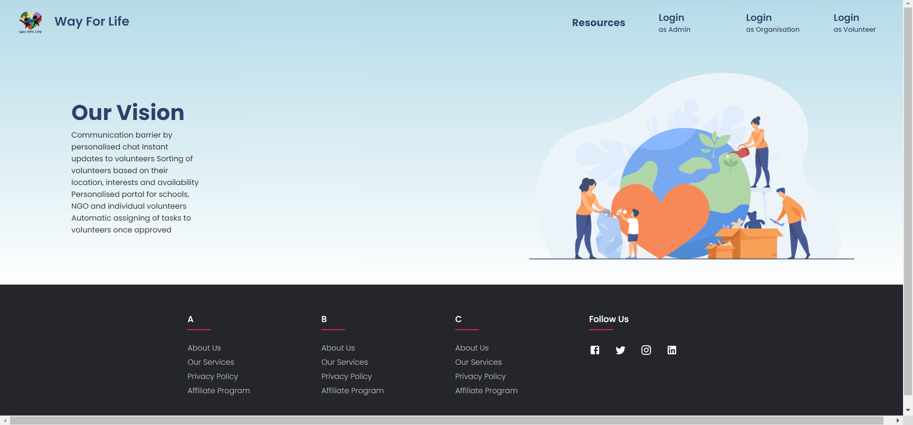

# Way For Life NGO
Web Application to reduce the communication gap between NGO, Volunteers and Organizations with personal Dashboard for each portal.

This is a MERN based project where volunteers can seek the work from the organization and can select what kind of work they are insterested in on the basis of their priorities.

